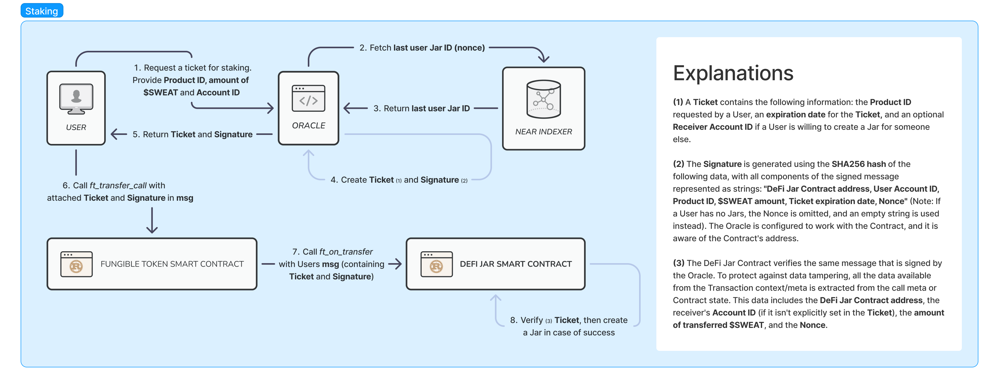
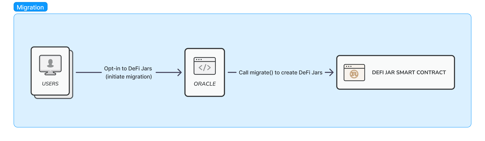
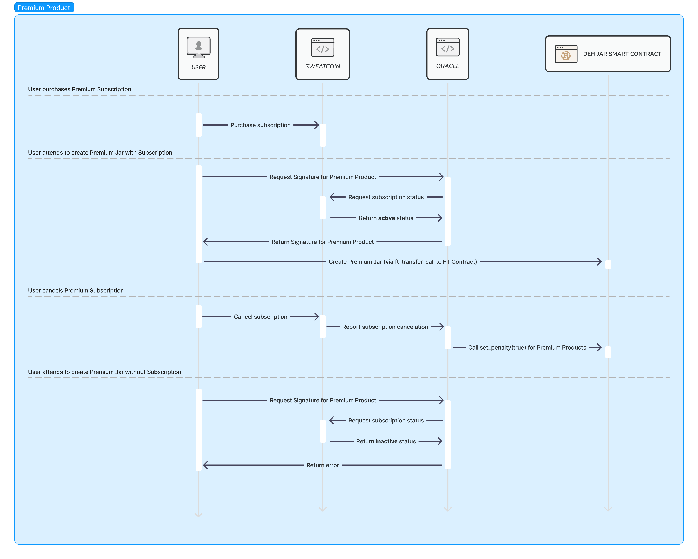

## 🔎 Project Overview

The DeFi Jars contract allows users to stake their NEP-141 fungible tokens and accrue interest from them. It is primarily designed to work with $SWEAT, but in general, it can be configured to work with any NEP-141 FT.

The contract enables a contract administrator to register Products describing the terms of deposits. Users can then stake FTs into Jars, which are deposits based on the specified Products. The contract also provides the ability to restrict the creation of Jars for specific Products based on external conditions and involves third-party services.

## Table of content
1. [**Terminology**](#1--terminology)
2. [**Functional Requirements**](#2--functional-requirements)
   1. [Roles](#21--roles)
   2. [Features](#22--features)
   3. [Use cases](#23--use-cases)
3. [**Technical requirements**](#3--technical-requirements)
   1. [Project structure](#31--project-structure)
      1. [Tooling](#311--tooling)
      2. [Artifacts](#312--artifacts)
      3. [Codebase](#313--codebase)
      4. [Integration tests](#314--integration-tests)
   2. [Architecture overview](#32--architecture-overview)
      1. [Actors](#321--actors)
      2. [Security](#322--security)
   3. [Migration strategy](#33--migration-strategy)
   4. [Premium Products and 3rd party subscriptions](#34-premium-products-and-3rd-party-subscriptions)

## 1. 📖 Terminology

The contract operates with the following entities:

- **Earnings Rate (ER):** This represents the rate, updated per minute, at which a user earns interest on their staked $SWEAT.
- **Product:** A Product defines a set of rules and terms for deposits (Jars).
- **Fixed Product:** A Product with a lockup period into which users can stake $SWEAT. Once the lockup period has matured, the staked amount becomes available for re-staking (with the same ER and period) or for unstaking (withdrawn into the user’s liquid balance). However, the user stops earning $SWEAT (ER) until it is re-staked.
- **Flexible Product:** A Product with no lockup period.
- **Premium Product:** A Product that has both default and fallback APY rates. A related Jar yields interest based on the default APY rate. However, if a user violates the terms of the Product, a penalty is applied, and the APY downgrades to the fallback value. Both Fixed and Flexible Products can be Premium.
- **Growth Jar:** This is a deposit that follows the terms of a Product. It includes the principal amount and earned interest.
- **Fixed Jar:** A Jar that follows the rules of a Fixed Product.
- **Flexible Jar:** A Jar that follows the rules of a Flexible Product.
- **Premium Jar:** A Jar that follows the rules of a Premium Product.
- **Token Contract:** A NEP-141 Fungible Token contract set upon the deployment of the DeFi Jars contract. The DeFi Jars contract interacts with this FT.

The contract allows users to perform the following actions:

- **Grow:** This term is used when referring to earning $SWEAT by depositing it into a Growth Jar.
- **Stake:** This is the act of sending funds to the contract under specific terms defined by the chosen Product.
- **Unstake:** This is the act of requesting the smart contract to release the exact amount of staked funds back to the original staker's address.
- **Restake:** This refers to the act of re-enacting a previous “stake” action under the same terms.
- **Claim:** This is the act of a user requesting the smart contract to release the accrued earnings from applied ERs on all or selected Jars containing funds.

## 2. 🧑‍💼 Functional Requirements

### 2.1. 👤 Roles

The DeFi Jars contract defines three roles:

- **Admin:** The Admin role manages Products. It can register new Products, enable or disable existing Products, and change verifying (public) keys.
- **User:** Users can create Jars by staking tokens, claim accrued interest, unstake their funds, and restake mature Jars.
- **Oracle:** While not directly represented in the contract, the Oracle role can issue signatures to restrict Users' access to specific Products based on conditions that cannot be evaluated within the contract itself.

### 2.2. ⚙️ Features

The DeFi Jars contract provides the following features:

- Register a new Product (Admin).
- Enable or disable an existing Product (Admin).
- Change the verifying (public) key for a Product (Admin).
- Stake $SWEAT to create a new Jar (User).
- Unstake (withdraw) $SWEAT from a Jar (User).
- Restake $SWEAT in a Jar once it's mature (User).
- Claim accrued $SWEAT from a Jar (User).
- Top up the $SWEAT balance of a Jar (User).

### 2.3. 🧑‍💻 Use cases

1. Admin can register a new Fixed Product. It must contain the Product ID, APY, Jar capacity, withdrawal fee, an optional verifying (public) key, lockup term, and indicators regarding whether it's enabled right after registration, allows top-ups, and allows restaking.
2. Admin can register a new Flexible Product. It must contain the Product ID, APY, Jar capacity, withdrawal fee, an optional verifying (public) key, and indicators regarding whether it's enabled right after registration.
3. Admin can enable or disable any registered Product. If a Product is disabled, a User cannot create new Jars for this Product. However, they can carry out top-ups and other operations with existing Jars.
4. Admin can set or change the verifying (public) key for a registered Product.
5. Admin can apply a penalty for any Premium Jar.
6. User can get details of a particular Jar.
7. User can get details of all Jars belonging to them.
8. User can get the total interest available to claim or interest for selected Jars.
9. User can get the total principal for all their Jars or principal for selected Jars.
10. User can get details of all Products registered in the contract.
11. User can stake $SWEAT and create a regular Jar for a chosen Product. To do that, the User must send $SWEAT to the Token Contract and attach a Ticket specifying a Product for which they want to stake.
12. User can stake $SWEAT and create a Premium Jar for a chosen Premium Product. To do that, the User must send $SWEAT to the Token Contract and attach a Ticket containing a Product for which they want to stake and the expiration date of this Ticket. The User also must attach a signature for this ticket obtained from an Oracle.
13. User can stake $SWEAT and create a Jar for another user. To do so, the User must specify the receiver's account ID in the message when they transfer $SWEAT to the Token Contract.
14. User can claim accrued $SWEAT from all their Jars or a specified set of Jars at any moment. To claim from a set of Jars, the User can either claim all available interest or set an amount they want to claim. If this amount is greater than the amount accrued at the moment, the maximum available amount is claimed.
15. User can withdraw the total principal of a Fixed Jar after its maturity. If a Product involves a withdrawal fee, the User pays this fee from the withdrawn principal amount.
16. User can withdraw any amount of $SWEAT from the principal of a Flexible Jar at any moment. If a Product involves a withdrawal fee, the User pays this fee from the withdrawn principal amount.
17. User can top up the principal of a Flexible Jar or Fixed Jar if the related Fixed Product allows top-ups.
18. User can restake a Fixed Jar after its maturity. On restake, a new Jar is created, and the principal of the original Jar is transferred to the new one.

## 3. 🤖 Technical requirements

DeFi Jar contract is a smart contract for NEAR network. It has been developed with Rust language using
[near-sdk-rs](https://github.com/near/near-sdk-rs). 

Integration tests are NEAR Workspaces ([workspaces-rs](https://github.com/near/near-workspaces-rs)) sandbox tests.

The smart contract uses [ed25519-dalek](https://github.com/dalek-cryptography/curve25519-dalek/tree/main/ed25519-dalek) to verify signatures for Premium Products.

### 3.1. 🧬 Project structure

Here is an overview of the project structure:

```bash
.
├── Cargo.toml
├── Makefile
├── README.md
├── contract
├── docs
├── integration-tests
└── scripts
```

`cargo` and `integration-tests` are regular cargo projects with their respective layouts.

Start by reading `README.md` to access comprehensive information about building, testing, and deploying a smart contract.

#### 3.1.1. 🛠️ Tooling

The `Makefile` contains useful commands for building, testing, and deploying the contract. 
These commands either operate on `cargo` or run scripts found in the `scripts` directory. 
To view all the available commands for `make`, use the following command:

```shell
make help
```

#### 3.1.2. 📦 Artifacts

The `res` directory contains WASM binaries:

- **sweat.wasm**: Assembled FT token contract for testing purposes.
- **sweat_jar.wasm**: The actual version of the DeFi Jar contract.

#### 3.1.3. 💿 Codebase

Under the `./contract` directory, you can locate the smart contract module. Project configuration and dependencies are 
found in the `Cargo.toml` file. The lib.rs file contains the contract data structure and initialization code. 
Each of the _claim, jar, penalty, product, and withdraw_ modules contains feature-specific code. 
These modules consist of the following parts:

- **api.rs** – Describes public methods for the feature.
- **model.rs** – Contains data structures for internal use within the contract.
- **view.rs** – Contains data structures to receive from a client or return to them. These structures reflect structs from model.rs, hiding redundant data and providing more readable or easily parsable types.

Structures and API traits in these files are documented, so you can refer to this documentation.

The `ft_interface.rs` file contains helpers to facilitate interaction with the related FT contract.

The code in `ft_receiver.rs` handles incoming Token transfers. This mechanism is used for Jar creation, top-ups, and migration.

#### 3.1.4. 🧪 Integration tests

The `./integration-tests` directory contains integration tests for the smart contract. 
These tests work with both FT and DeFi Jars contracts, covering the following scenarios:

- **happy_flow.rs:** This scenario represents the successful registration of a product, the creation of a Jar, and the accrual of interest.
- **migration.rs:** These tests focus on the batched migration of CeFi $SWEAT Jars to the contract.
- **withdraw_fee.rs:** These tests deal with withdrawing Jars with fees, checking for the correct transfer of principal to a user account and fees account.

In addition to these files, it also contains utilities and testing data, with the most significant being:

- **context.rs:** This provides context for a test suite, loading artifacts, granting access to smart contract interfaces, and enabling time travel.
- **ft_contract_interface.rs:** This offers an interface for the FT Contract API.
- **jar_contract_interface.rs:** This provides an interface for the DeFi Jar Contract API.

## 3.2. 📐 Architecture overview

### 3.2.1. 🎭 Actors

The contract involves the participation of the following entities:

- **DeFi Jar Contract:** This contract handles $SWEAT deposits (Jars) and manages their operations.
- **NEP-141 Fungible Token Contract** ($SWEAT Token contract): This contract facilitates token transfers and is responsible for triggering the execution of the DeFi Jar Contract's logic when it receives tokens. 
- **Oracle**: This third-party entity possesses additional information about Contract users. In the context of the Contract, the Oracle's role is to validate that users have the authorization to create Jars, and to generate Signatures for them. 
- **Consumer** (NEAR Indexer): The Consumer observes events emitted by the **DeFi Jar Contract**. It maintains a connection between users' on-chain data and their data in third-party services.

Refer to the following chart for a detailed overview of the entities involved within the system during the Staking process.



### 3.2.2. 🔐 Security

To prevent data tampering and unauthorized access to Products, an [Ed25519 signature system](https://ed25519.cr.yp.to/) 
is utilized. When authorization checks are necessary to create Jars for a Product, the Product must include 
a verifying (public) key. In this scenario:

- An Oracle generates a keypair and securely stores the private key.
- Subsequently, the Oracle provides the public key to an Admin, who then uses this public key to create a Product.
- In case the private key is compromised, the Oracle has the ability to generate a new keypair, and the Admin can update the public key associated with a Product.

To perform a sensitive operation (currently limited to Jar creation), a User must obtain a signature from the Oracle. 
This signature must be included along with other required arguments. The Contract then composes a message identical 
to the one signed by the Oracle, incorporating the provided arguments and contextual data. 
Subsequently, the Contract verifies this message against the Signature, using the Product's public key, to ensure 
the prevention of tampering.

## 3.3. 🚃 Migration strategy

Sweat Economy already offers a CeFi staking product. One of the goals is to migrate these centralized deposits to the blockchain.
Migration occurs on-demand, and a User must choose to opt into the DeFi Jars to migrate their existing deposits.
To prepare for migration, an Admin must create Products that reflect those existing in the third-party CeFi service. 
These Products can be disabled from the beginning, and it shouldn't impact the migration process. This feature is convenient for managing legacy Products.
The Migration API provides a batched method for migration, thus enabling flexibility for Oracle implementation.

Here's a chart illustrating the migration process:



## 3.4. 💎 Premium Products and 3rd party subscriptions

As the Contract allows for the creation of Premium (protected) Products, the system can involve third parties to verify 
whether a user is authorized to use these Products or impose penalties in case of violations of Premium Product terms. 
In the case of $SWEAT, the third party is _Sweatcoin_, and a user is authorized to create Premium Products only when 
they have a _Sweatcoin Premium Subscription_. Since this information is off-chain, an Oracle is essential for 
verification. Numerous other scenarios, such as giveaways and rewards, can also enable access to Premium Products.

For these purposes, two mechanisms are provided:

1. Premium Products can be protected by [Ed25519 signing](#322--security). In this case, a user must obtain a signature to use Premium Products.
2. An Oracle can monitor the state of the third-party service. In the event of terms violations, it can act as an Admin and apply penalties for the user's Premium Jars.

Here's a chart illustrating the interaction of system Actors in the case of purchasing and canceling a Premium Subscription:


